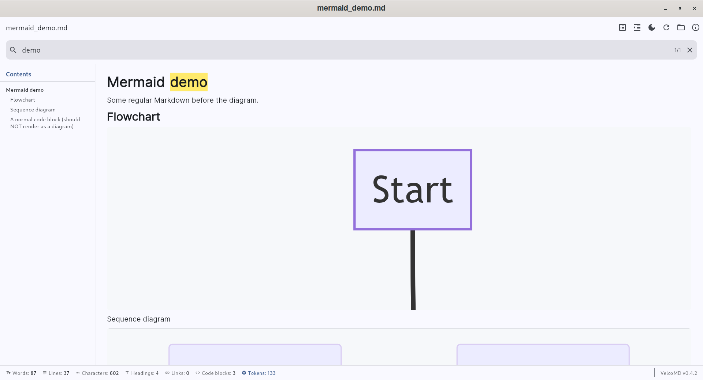
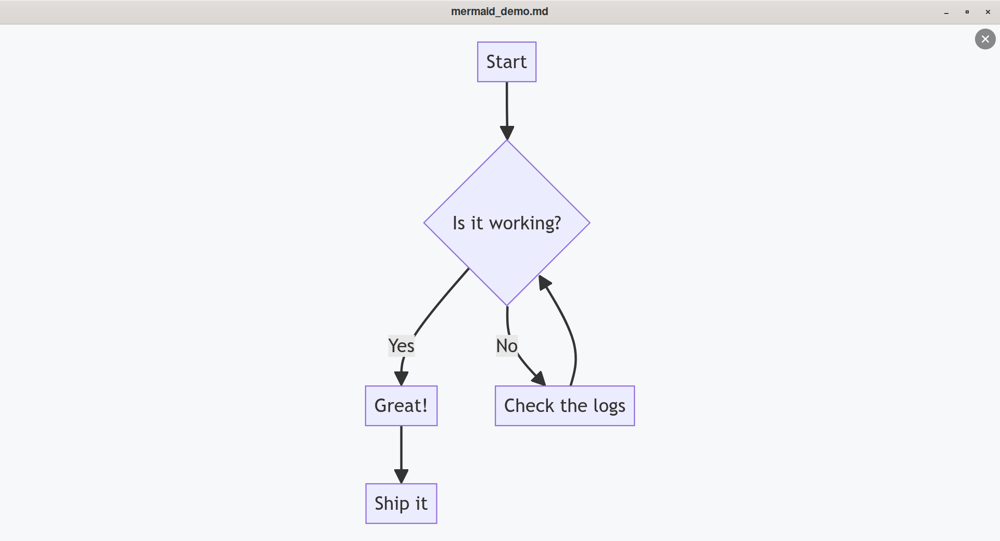

<p align="center">
  
</p>

<h1 align="center">VeloxMD</h1>

<p align="center">
  <b>A fast, beautiful way to read Markdown files on your desktop.</b>
</p>

---

## What is VeloxMD?

VeloxMD is a simple app for opening and reading **Markdown** files — the
lightweight text format used for notes, README files, documentation, and more.

Just open a file and VeloxMD turns it into a clean, easy-to-read page with
proper headings, tables, links, and even diagrams. No clutter, no waiting.

It works completely **offline** — you don't need an internet connection, and
nothing you open ever leaves your computer.

## Screenshots

Reading a document, with the table of contents, live search, and a diagram all
in one clean window:



Click any diagram to see it full screen, where you can zoom and pan freely:



## Why you'll like it

- ⚡ **Instant** — files open and display immediately, even large ones.
- 🌙 **Easy on the eyes** — switch between light and dark themes with one click.
- 📑 **Never lose your place** — an automatic table of contents lets you jump
  to any section.
- 🔎 **Find anything** — search the whole document and jump between matches.
- 🔄 **Always up to date** — edit the file in another app and VeloxMD refreshes
  the view for you automatically.
- 📈 **Diagrams that just work** — flowcharts and charts written as text
  (Mermaid) are drawn out as real diagrams.
- 🖱️ **Simple to use** — open files by drag-and-drop, a button, or a keyboard
  shortcut.
- 🔒 **Private & offline** — everything runs on your computer, with no internet
  required.

## Getting started

The easiest way to run VeloxMD is to download a ready-made version.

### Windows

1. Go to the [**Releases page**](https://github.com/lbonomo/VeloxMD/releases).
2. Download the file named `veloxmd-setup-windows-x64-v...exe`.
3. Run it and follow the installer.

### Linux

Prebuilt Linux packages (`.deb` / AppImage) are published on the
[**Releases page**](https://github.com/lbonomo/VeloxMD/releases) when available.
Otherwise, see [Building from source](#building-from-source) below.

## How to use it

- **Open a file:** click the open button, drag a `.md` file onto the window,
  or press `Ctrl+O`.
- **Show the table of contents:** press `Ctrl+T`.
- **Switch light / dark theme:** use the toggle in the toolbar.
- **Reload a file:** press `Ctrl+R` or `F5`.
- **Change font size:** press `Ctrl++`, `Ctrl+-`, or `Ctrl+0`.

### Keyboard shortcuts

| Shortcut | Action |
|----------|--------|
| `Ctrl+O` | Open a file |
| `Ctrl+T` | Show / hide the table of contents |
| `Ctrl++` / `Ctrl+-` / `Ctrl+0` | Increase / decrease / reset font size |
| `Ctrl+R` / `F5` | Reload the current file |
| `Ctrl+Q` | Quit |

Supported file types: `.md`, `.markdown`, `.mdc`, and `.txt`.

---

<details>
<summary><b>Building from source</b> (for developers)</summary>

VeloxMD is built with [Flutter](https://flutter.dev) for the Linux and Windows
desktop.

### Linux (primary platform)

**Prerequisites**

- Flutter SDK ≥ 3.27 with Linux desktop support enabled
- GTK 3 development libraries (`libgtk-3-dev` on Debian/Ubuntu)
- A C++20 toolchain and CMake/Ninja (`clang`, `cmake`, `ninja-build`, `pkg-config`)
  — required by the embedded Chromium engine used for Mermaid diagrams

> ℹ️ The **first** Linux build downloads the Chromium Embedded Framework
> (CEF, ~330 MB) and compiles it, so the initial build takes noticeably longer.
> Subsequent builds are fast.

**Commands**

```bash
# Enable the Linux desktop target (once)
flutter config --enable-linux-desktop

# Fetch dependencies
flutter pub get

# Run in debug mode
flutter run -d linux

# Build a release binary
flutter build linux --release
# Output: build/linux/x64/release/bundle/veloxmd

# Open a specific file from the terminal
./veloxmd path/to/document.md
```

### Windows

```bash
# Build a Windows release binary
flutter build windows --release
```

To build the installer with Inno Setup, see
[windows/installer/README.md](windows/installer/README.md).

Windows installers are also built automatically and published as release assets
when a GitHub release is created (see `.github/workflows/build-windows.yml`).

### Running tests

```bash
flutter test
```

### Project structure

```
lib/
├── main.dart                – entry point, window manager initialisation
├── app.dart                 – MaterialApp, theme management
├── screens/
│   └── viewer_screen.dart   – main UI: toolbar, drag-drop, keyboard shortcuts
├── widgets/
│   ├── markdown_viewer.dart – flutter_markdown widget with custom styling
│   ├── mermaid_view.dart    – offline Mermaid diagram renderer (webview_cef)
│   ├── toc_panel.dart       – table of contents side panel
│   ├── document_footer.dart – document statistics footer with token counter
│   └── dialogs/
│       └── about_dialog.dart – about dialog with project and developer info
├── models/
│   ├── toc_entry.dart       – heading model + Markdown parser
│   └── document_stats.dart  – document statistics and token calculation
└── services/
    └── file_service.dart    – async file reading with validation
```

### Desktop integration (Linux)

A `.desktop` file is provided at `linux/runner/resources/veloxmd.desktop` so the
app can be registered as a handler for `text/markdown` files in any
XDG-compliant desktop environment:

```bash
cp linux/runner/resources/veloxmd.desktop ~/.local/share/applications/
update-desktop-database ~/.local/share/applications/
```

</details>

## License

See the repository for license details.
