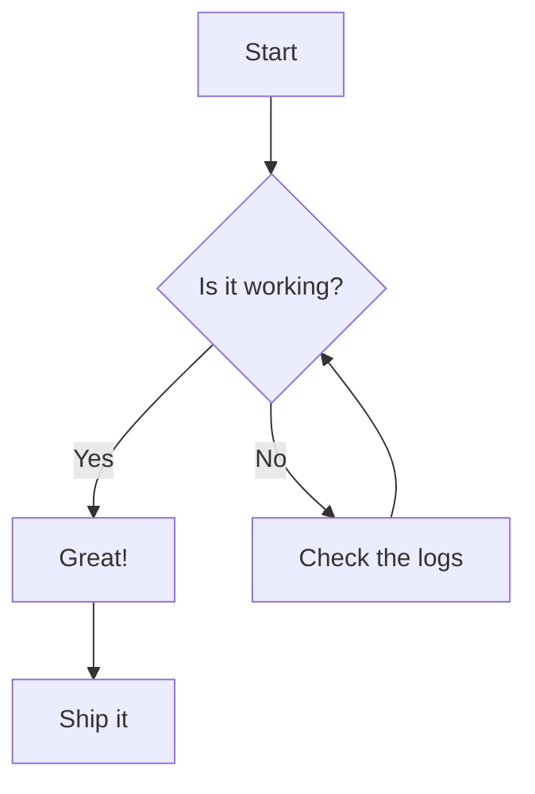
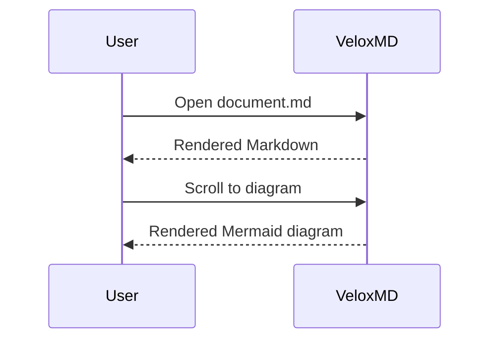

# Mermaid demo

Some regular Markdown before the diagram.

## Flowchart



## Sequence diagram



## A normal code block (should NOT render as a diagram)

```dart
void main() {
  print('Hello, VeloxMD');
}
```

## Shell script

```sh
#!/bin/sh
echo "Hello from sh"
```

## Bash script

```bash
#!/usr/bin/env bash
set -euo pipefail
echo "Hello from bash"
```

## SQL query

```sql
SELECT id, title
FROM todos
WHERE status = 'done';
```

## JSON

```json
{
  "name": "VeloxMD",
  "type": "demo"
}
```

## YAML

```yaml
name: VeloxMD
enabled: true
items:
  - markdown
  - mermaid
```

## TOML

```toml
[app]
name = "VeloxMD"
version = "0.5.0"
```

## Python

```python
def greet(name):
    return f"Hello, {name}"
```

## Go

```go
package main

import "fmt"

func main() {
    fmt.Println("Hello from Go")
}
```

## JavaScript

```js
console.log("Hello from JavaScript");
```

## Diff

```diff
- old line
+ new line
```

Some text after the diagrams and code blocks.
