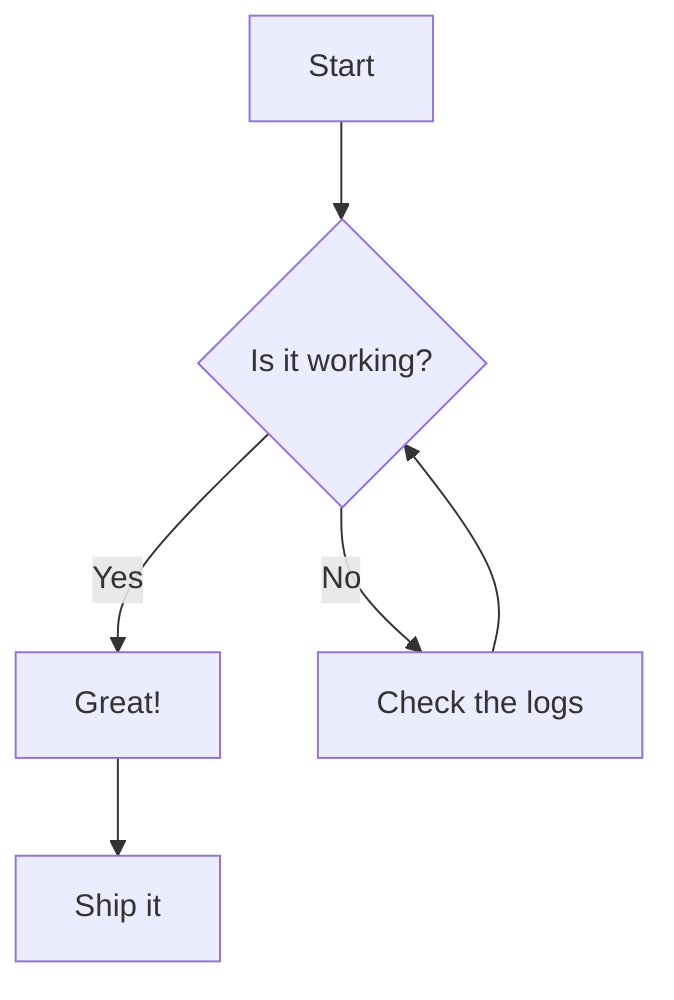
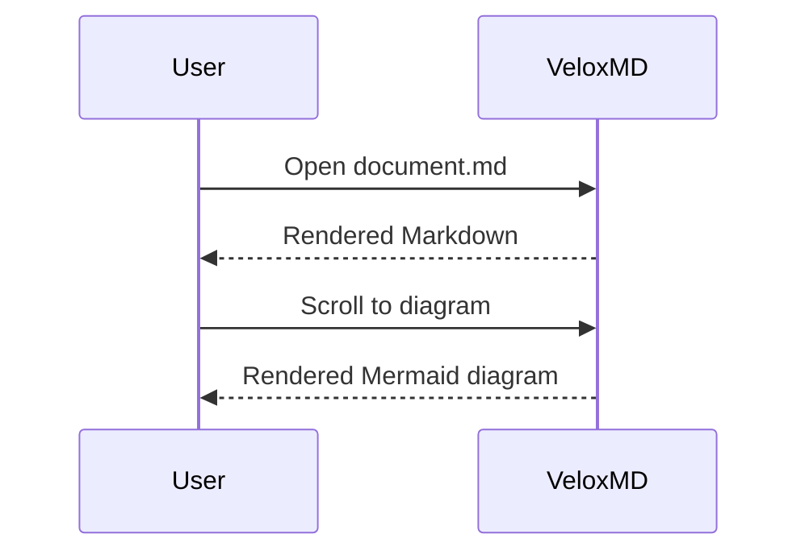

# Mermaid demo

Some regular Markdown before the diagram.

## Flowchart



## Sequence diagram



## A normal code block (should NOT render as a diagram)

```dart
void main() {
  print('Hello, VeloxMD');
}
```

Some text after the diagrams.
